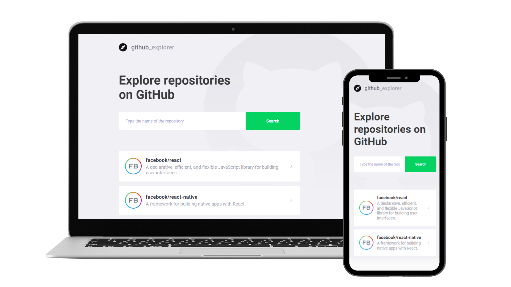

<div align="center">

<p align="center">
  
<p>

<p align="center">
  
  
</p>

**Github Explorer** is a project that uses API from GitHub to create a mini organized list of repositories and their issues.


The idea of this mini project is just to boost my abilities with React.js, Typescript, and Styled Components.

<p align="center">
  
<p>

</div>

## Features

- Add a repository from GitHub (example: 'facebook/react') and see their issues.
- Pagination of the issues with Back and Next buttons.

## Summary

- [Technology](#rocket-technology)
  - [Application](#computer-web)
- [How to run](#boom-how-to-run)
  - [Web](#computer-web-1)


## :rocket: Technology

<div align="center">


</div>


## :computer: Application

The application was developed with [Typescript](https://www.typescriptlang.org/) using the framework [ReactJS](https://reactjs.org/) and [Styled-Components](https://styled-components.com/) for visual proposes.

I'm using Github API to collect all the information about the repository and their issues.

---

# :boom: How to run

- ### **Prerequisites**

  - It's **necessary** to have **[Node.js](https://nodejs.org/en/)** installed on the computer
  - It's **necessary** to have **[Git](https://git-scm.com/)** installed and configured on the computer
  - Also, it's **necessary** to have a package manager either **[NPM](https://www.npmjs.com/)** or **[Yarn](https://yarnpkg.com/)**.

Clone the repository:

```sh
  $ git clone https://github.com/paulo-carvalho93/github-explorer.git
```

## :computer: Web

```sh
  # API
  $ cd github-explorer
  # Installing project dependencies.
  $ yarn # or npm install

  # Start Web Project
  $ yarn start # or npm start

  # Do you want to publish ?
  $ yarn build # or npm build
  # Static files for web will be saved in the `public` folder

```
